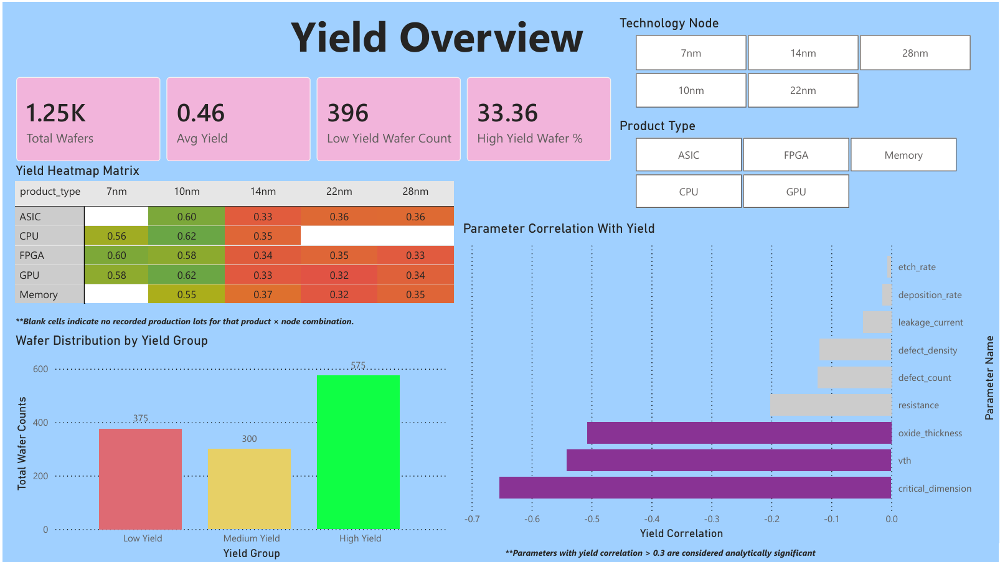
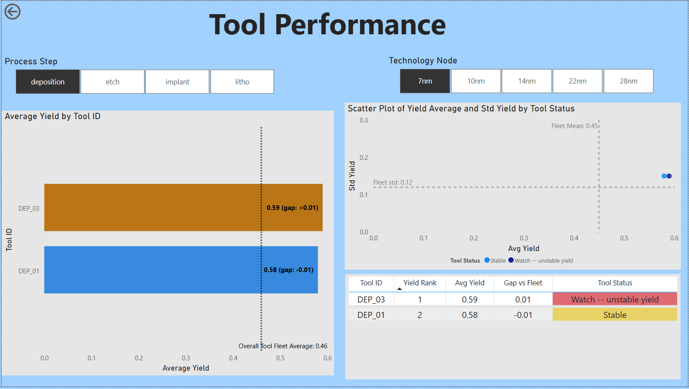
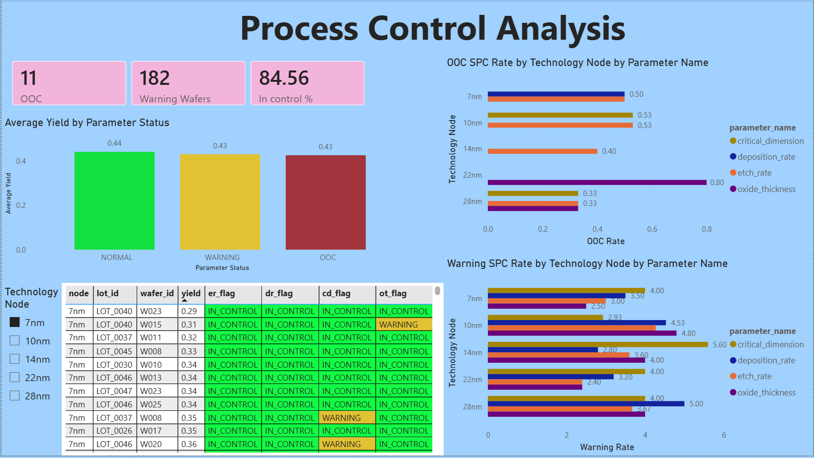
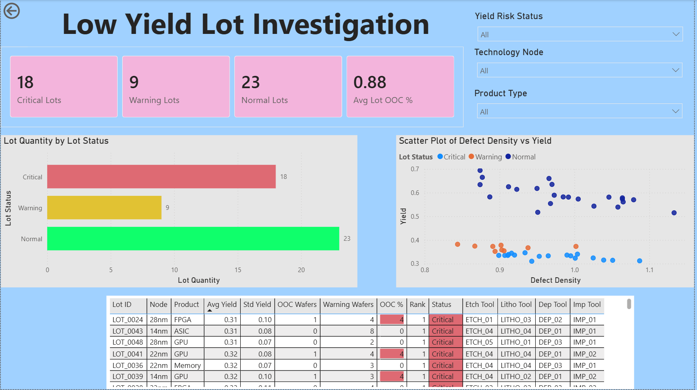

# Semiconductor-Yield-Analysis

## Business Context

In semiconductor manufacturing, wafer yield (the percentage of functional die produced per wafer) determines the commercial viability of every product line. Yield loss stems from a complex interplay of equipment health, process parameter drift, and product-node compatibility. Identifying root causes requires systematic analysis across thousands of wafer records, multiple process steps, and dozens of process parameters simultaneously.

This analysis replicates the analytical workflow of a real fab yield investigation: equipment performance benchmarking, SPC-style process control monitoring, defect-yield correlation analysis, and lot-level failure triage — all implemented in SQL and Python, and presented through an interactive Power BI dashboard designed for multiple engineering stakeholders.

---
## Dataset

> **Dataset note:** This dataset were found on Kaggle and used for analytical practice only. All process parameter names, tool IDs, column structures, and process flow conventions reflect real semiconductor manufacturing practice.

| Attribute | Detail |
|---|---|
| Total wafers | 1,250 |
| Total lots | 50 (25 wafers per lot) |
| Technology nodes | 7nm, 10nm, 14nm, 22nm, 28nm |
| Product types | ASIC, CPU, FPGA, GPU, Memory |
| Process steps | Etch, Lithography, Deposition, Implant |
| Date range | Jan–Feb 2023 (50 days) |
| Null values | Zero across all 28 columns |
| Key columns | `yield`, `defect_density`, `critical_dimension`, `oxide_thickness`, `vth`, `etch_rate`, `deposition_rate`, `thickness_uniformity`, `tool ID` |

**Source:** https://www.kaggle.com/datasets/ayyappanmarimuthu/semiconductor-yield

Not all product types are manufactured on every technology node — blank cells in the yield heatmap reflect realistic fab tool qualification constraints, not data gaps.

---

## Tools & Stack

| Layer | Tool | Purpose |
|---|---|---|
| Data storage | PostgreSQL | Raw data storage and querying |
| Query editor | DBeaver | SQL development and result export |
| Analysis | Python (JupyterLab) | Statistical analysis, correlation, ML modelling |
| Visualisation | Power BI Desktop | Interactive 4-page engineering dashboard |
| Version control | GitHub | Portfolio hosting and project documentation |

**Python libraries:** pandas, matplotlib, seaborn, scikit-learn, statsmodels

---

## Stakeholder Questions

This project is structured around four business questions, each addressed to a named engineering stakeholder:

| # | Question | Stakeholder |
|---|---|---|
| 1 | Which etch, litho, deposition, and implant tools are underperforming their fleet average, and which show unstable yield variance? | Yield engineer / Equipment engineer |
| 2 | Which process parameters are out of statistical control, and does parameter excursion predict yield outcome? | Process engineer / SPC coordinator |
| 3 | Which process parameters correlate most strongly with yield, and can yield be predicted from in-line measurements? | Process engineer / Data analyst |
| 4 | Which lots are at critical yield risk, and what process and equipment factors are associated with low-yield lots? | Yield engineer / Engineering manager |

---

## Analytical Methodology

### Phase 1 — SQL Analysis (PostgreSQL + DBeaver)

**01 — Data profiling and quality check**
Row count, null detection across all 28 columns, duplicate check on `lot_id` + `wafer_id` grain. Result: zero nulls, no duplicates. Data confirmed clean before analysis.

**02 — Equipment performance ranking**
Tool yield benchmarking using CTEs and window functions. Fleet mean and fleet standard deviation computed per technology node. Each tool classified using a two-dimensional status framework:

| Status | Condition |
|---|---|
| Best Performer | (avg_yield >= fleet_mean) AND (std_yield <= fleet_std) |
| Critical | (avg_yield < fleet_mean - 0.5*fleet_std) AND (std_yield > fleet_std) |
| Underperforming | (avg_yield < fleet_mean - 0.5*fleet_std) AND (std_yield <= fleet_std) |
| Watch — unstable yield | (avg_yield >= fleet_mean - 0.5*fleet_std) AND (std_yield > fleet_std) |
| Stable | std_yield ≤ fleet_std |

Key SQL techniques: `WITH` CTEs, `RANK() OVER (PARTITION BY)`, `CROSS JOIN` for fleet benchmarks, `CASE` multi-tier classification.

**03 — SPC process control analysis**
±3σ and ±2σ control limits calculated per technology node for four parameters: etch_rate, deposition_rate, critical_dimension, oxide_thickness. Each wafer flagged as OOC, WARNING, or IN_CONTROL per parameter. Z-scores computed to quantify deviation magnitude. Results pivoted using `UNION ALL` to produce a summary of OOC and WARNING rates by node and parameter.

Key SQL techniques: `AVG()` + `STDDEV()` as control limit basis, `BETWEEN` for flag logic, `UNION ALL` for long-format pivot, `FILTER (WHERE ...)` for conditional counts.

**04 — Yield group analysis**
Wafers segmented into Low Yield (< 0.35), Medium Yield (0.35–0.50), and High Yield (≥ 0.50). Average process parameters compared across groups by technology node to identify process signatures of low-yield wafers.

**05 — Low yield lot investigation**
Lot-level aggregation combining yield metrics, tool combinations, process parameter averages, and SPC violation counts per lot. Each lot classified as Critical (< 0.35), Warning (0.35–0.50), or Normal. Lot OOC rate calculated as percentage of wafers with any parameter breach. Ranked within each node × product peer group using `RANK() OVER (PARTITION BY)`.

---

### Phase 2 — Python EDA & Modelling (JupyterLab)

**Correlation analysis**
Pearson correlation computed across all 18 numeric parameters against yield. Results visualised as a heatmap.

**Multicollinearity check (VIF)**
Variance Inflation Factor analysis conducted in three rounds:
- Round 1 (all 7 selected features): defect_density VIF = 65,312 and thickness_uniformity VIF = 51,923 — perfect collinearity confirmed (r = 1.00 in heatmap)
- Round 2 (after removing `defect_density`): remaining features still show high VIF due to synthetic data structure
- Round 3 (final 3 features — CD, vth, oxide_thickness): selected based on yield correlation threshold |r| > 0.30

**Yield group boxplot analysis**
Distribution of key parameters across Normal Yield vs Low Yield groups. Confirmed which parameters show meaningful separation between yield groups.

**Predictive modelling**
Four models evaluated using 80/20 train-test split:

| Model | Features | MAE | RMSE | R² |
|---|---|---|---|---|
| Linear Regression | Key (3) | 0.1009 | 0.1284 | 0.4725 |
| Linear Regression | Full (15) | 0.1039 | 0.1327 | 0.4367 |
| Random Forest | Key (3) | 0.0913 | 0.1127 | 0.5937 |
| Random Forest | Full (15) | 0.0915 | 0.1102 | 0.6111 |

Random Forest feature importance computed on full feature set to rank all 15 parameters by predictive contribution.

> **Model note:** R² values should be interpreted with caution — since this dataset is synthetically generated, which produces artificially consistent parameter-yield relationships not representative of real production variability. The feature importance rankings are the primary output of interest, not the predictive accuracy figures.

---

### Phase 3 — Power BI Dashboard (4 pages)

Interactive dashboard designed for multiple engineering stakeholders, with drill-through navigation from the executive yield overview to lot-level investigation.

---

## Key Findings

### Yield overview

- Fleet average yield across 1,250 wafers: **0.46**
- **10nm is the best-performing node** — CPU and GPU both achieve avg yield 0.62, the highest in the fleet
- **22nm shows the worst yield** — GPU at 0.315 and Memory at 0.323 represent the lowest node-product combinations across the entire dataset
- **14nm has a systematic yield problem** — all five product types on 14nm yield below 0.37, suggesting a node-level process issue rather than a tool-specific excursion
- Yield distribution: 375 Low Yield wafers (30%), 300 Medium Yield (24%), 575 High Yield (46%)

### Equipment performance

- **ETCH_04 on 10nm** is the only etch Best Performer across all nodes — avg yield 0.62, +0.03 above fleet mean, with stable variance
- **LITHO_02 on 10nm** leads the litho fleet at 0.64 avg yield, +0.05 above fleet mean — the largest positive gap observed across all tool rankings
- **DEP_01 on 28nm** achieves Best Performer status at 0.37, +0.02 above fleet mean
- **IMP_03 on 28nm** is the top implant tool at 0.38, +0.03 above fleet mean
- Watch-flagged tools are consistently characterised by std_yield exceeding fleet std — elevated variance rather than low average yield is the primary risk signal
- On 14nm, all etch tools perform below the overall fleet mean of 0.46, suggesting process conditions on this node suppress yield regardless of tool identity

### Process control (SPC)

- Fleet-wide in-control rate: **84.56%** (1,057 of 1,250 wafers)
- **11 OOC wafers** detected across all nodes and parameters
- **182 Warning wafers** flagged for parameter deviation between 2σ and 3σ
- **22nm oxide_thickness** shows the highest OOC rate at **0.80%** — the standout process control concern in the dataset
- **14nm critical_dimension** shows the highest Warning rate at **5.60%** — consistent with the node-level yield suppression observed in the overview
- OOC wafers yield 0.43 on average vs 0.44 for Normal wafers — a marginal difference of 0.01. This weak SPC-yield correlation is a known limitation of the synthetic dataset; in real production, OOC events typically correlate with 5–15% yield reduction

### Correlation and feature importance (Python)

- **critical_dimension** is the strongest yield predictor: Pearson r = **-0.653**
- **vth** (threshold voltage): r = **-0.541**
- **oxide_thickness**: r = **-0.507**
- These three parameters alone explain **72.4%** of total Random Forest model importance
  - critical_dimension: **57.9%** importance (dominant — nearly 6× more than second feature)
  - vth: **10.4%**
  - oxide_thickness: **4.1%**
- `thickness_uniformity` and `defect_density` exhibit perfect multicollinearity (r = 1.00, VIF > 65,000) — confirmed redundant; one removed before modelling
- `etch_rate` and `deposition_rate` show negligible yield correlation (r < -0.02) and near-zero feature importance — well-controlled parameters in this dataset
- Low Yield wafers show CD median ~27.5nm vs Normal Yield median ~22.5nm — a **~5nm systematic deviation** confirmed by boxplot analysis
- Linear Regression performs better with 3 key features (R² 0.4725) than with 15 full features (R² 0.4367) — direct consequence of multicollinearity penalising linear models

### Lot investigation

- **18 Critical lots** (avg yield < 0.35), **9 Warning lots** (0.35–0.50), **23 Normal lots** (≥ 0.50)
- **LOT_0024 (28nm FPGA)** is the worst-performing lot at avg yield **0.310**
- **28nm has the highest concentration of Critical lots** (9 lots), followed by 14nm (6 lots)
- Critical lots cluster in the higher defect density range (0.95–1.05) on the scatter plot — directional evidence that defect density contributes to lot-level yield risk, though the relationship is weak due to the synthetic data structure
- ETCH_04 and LITHO_04 appear together in multiple Critical lots on 14nm and 22nm — a tool combination pattern worth flagging for engineering review

---

## Dashboard Preview

### Page 1 — Yield Overview
Executive summary for engineering management. Yield heatmap matrix (product × node), wafer distribution by yield group, and parameter correlation ranking.

### Page 2 — Tool Performance
Equipment benchmarking for yield and equipment engineers. Interactive process step slicer (Etch / Litho / Deposition / Implant) with technology node filter. Bar chart with fleet mean reference line, yield-vs-variance scatter plot, and ranked summary table with conditional formatting.

### Page 3 — Process Control Analysis
SPC monitoring for process engineers. OOC and Warning rate by node and parameter, average yield by SPC status, and wafer-level flag table with lot and wafer ID for investigation traceability.

### Page 4 — Low Yield Lot Investigation
Drill-through page accessible from the Page 1 heatmap. Lot risk classification, defect density vs yield scatter, and full investigation table with tool combination columns, OOC rate data bars, and rank within peer group.

---
## Engineering Recommendations

Based on analysis of 1,250 wafers across 50 lots, five recommendations are prioritised by expected impact:

**1. Initiate tool qualification review for Watch-status tools on critical nodes**
Tools flagged Watch carry acceptable average yield but elevated variance — ETCH_01 and ETCH_03 on 7nm, LITHO_03 on multiple nodes. Variance above fleet std is an early indicator of process drift. Recommend scheduling recipe re-optimisation and PM inspection before these tools degrade into Underperforming status. Expected impact: stabilise yield on affected lots and reduce excursion frequency.

**2. Investigate 14nm node-level process conditions**
All five product types on 14nm yield below 0.37 — a systematic suppression not explained by individual tool performance. All etch tools on 14nm fall below the overall fleet mean of 0.46. This pattern suggests a recipe, consumable, or process condition issue at the node level. Recommend a focused 14nm process capability study. Expected impact: if 14nm yield improves to 10nm levels, approximately 125 wafers shift from Low to High Yield category.

**3. Prioritise critical_dimension control as primary yield lever**
CD shows the strongest negative correlation with yield (r = -0.653) and accounts for 57.9% of Random Forest model importance. Low Yield wafers show a ~5nm higher CD median than Normal Yield wafers. Tightening CD control through litho recipe optimisation and enhanced in-line CD monitoring is the single highest-impact process lever available. Recommend reducing CD spec limits on 14nm and 22nm nodes first.

**4. Establish OOC action protocol for 22nm oxide_thickness**
The 22nm oxide_thickness parameter shows the highest OOC rate in the fleet (0.80%). While the absolute wafer count is small (1 wafer), an OOC event at 3σ+ deviation on a structural parameter warrants immediate process hold and root cause investigation. Recommend implementing an automated hold trigger when oxide_thickness on 22nm exceeds the calculated ±3σ control limits.

**5. Escalate LOT_0024 and 14nm ASIC / GPU lots for failure analysis**
LOT_0024 (28nm FPGA, yield 0.310) is the worst-performing lot in the dataset. The 14nm ASIC and 14nm GPU lots rank consistently in the bottom tier of their peer groups. The ETCH_04 + LITHO_04 tool combination appears repeatedly across Critical lots on 14nm and 22nm. Recommend cross-referencing these lots with equipment maintenance logs and consumable change records to identify a common root cause.

## Conclusion

This project demonstrates an end-to-end analytical workflow applied to a semiconductor manufacturing context — from raw data profiling through SQL, to statistical modelling in Python, to an interactive multi-stakeholder Power BI dashboard.

Across 1,250 wafers, 50 lots, and five technology nodes, three consistent findings emerge. First, **critical_dimension is the dominant yield driver** — confirmed independently by Pearson correlation (r = -0.653), boxplot separation (~5nm median difference between yield groups), and Random Forest feature importance (57.9%). This convergence across three analytical methods strengthens confidence in the finding beyond what any single method alone could provide. Second, **14nm exhibits a systemic yield suppression** affecting all five product types — a pattern that points to node-level process conditions rather than individual tool failures, and that would constitute a high-priority investigation item in a real production environment. Third, **tool variance is as important as tool average yield** — Watch-flagged tools with elevated std_yield represent a process stability risk that average-only rankings would miss entirely.

The synthetic nature of the dataset imposes known limitations: the SPC-to-yield correlation is weaker than real production data would produce, model R² values are artificially inflated, and the 50-day date range prevents meaningful time-series analysis. These limitations are documented transparently throughout — not concealed — because accurate interpretation of analytical outputs is as important as the outputs themselves.

Five engineering recommendations are prioritised by expected yield impact, covering tool qualification review, node-level process investigation, CD control tightening, OOC action protocols, and critical lot escalation. Together they form a structured action plan that translates analytical 
findings into operational next steps — the intended output of any engineering data analysis.

## Author

Xian Jin Lau
